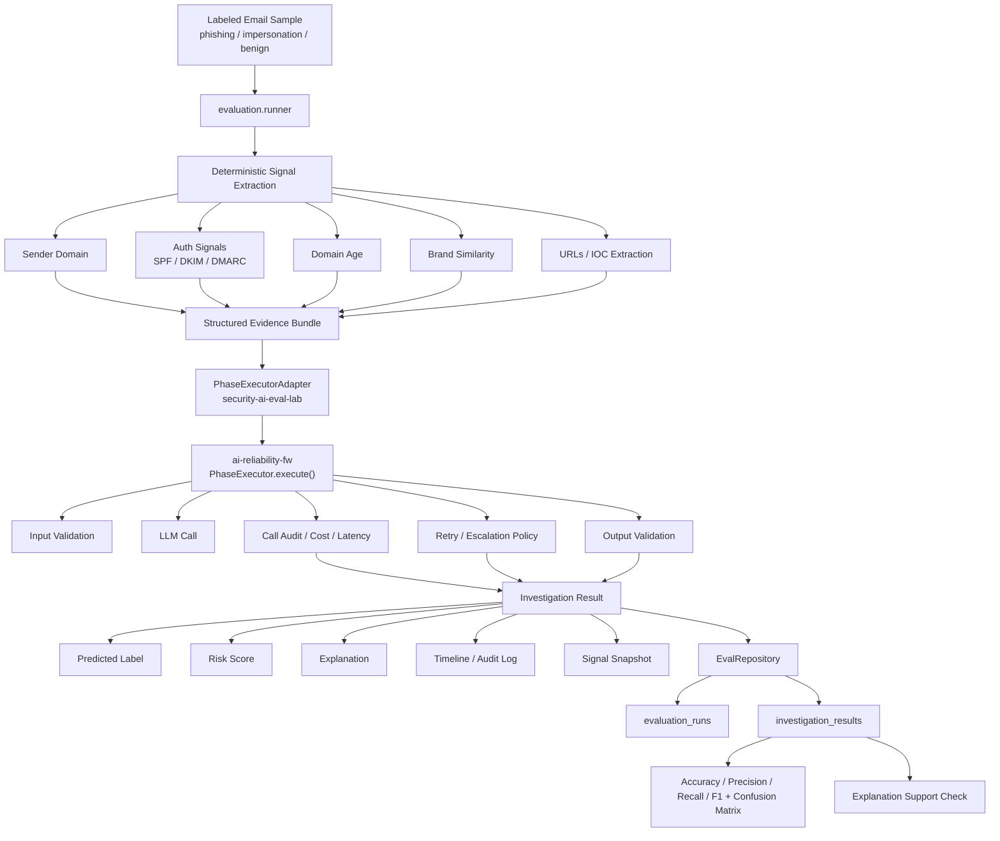

# Security AI Eval Lab

## What this project demonstrates

This project explores how LLMs can safely assist in security investigations.

It combines:

- deterministic security signal extraction  
- validated LLM reasoning pipelines  
- reproducible evaluation datasets  
- measurable detection metrics  
- demo-safe, DB-backed report exports  

The goal is to evaluate how well different models perform on
security tasks such as phishing and impersonation detection.

## What problem it explores
A small framework for evaluating LLMs on security investigation tasks using deterministic signal enrichment, validated LLM reasoning pipelines, and reproducible experiment outputs.


## Why deterministic signals + LLM reasoning

Deterministic signals (domain age, SPF/DKIM/DMARC, brand lookalike scoring, URL extraction)
are fast, auditable, and reproducible. LLM reasoning adds contextual judgment that
rule-based systems miss. Separating the two layers means:

- Signals can be unit-tested independently of the LLM.
- The LLM prompt receives structured, validated input — not raw email text.
- Output validation catches hallucinated labels before they reach callers.
- Cost and latency are measured per call and stored for benchmarking.
- DB-sourced reports aggregate tokens, cost, latency, and retry counts.

## Architecture diagram



## MVP capabilities

- Phishing, impersonation, and benign email classification
- Deterministic signal extraction: sender domain, URLs, auth results (SPF/DKIM/DMARC), domain age, brand similarity
- LLM reasoning via ai-reliability-fw's `PhaseExecutor` over Anthropic API with input/output validation and retry logic
- Reproducible evaluation runs with per-sample results stored in the eval-lab tables in Postgres
- Accuracy, precision, recall, F1, macro/micro/weighted averages, and confusion matrix
- Explanation support check (rule-based, lightweight grounding audit)
- DB-sourced report generation (JSON/Markdown) with demo-safe mode and golden snapshots
- FakeReliabilityExecutor for local testing without a DB or API key

## Core components

| Component | Location | Purpose |
|---|---|---|
| `EmailThreatInvestigationAgent` | `agents/email_threat_agent.py` | Sync quickstart agent for the fake executor path |
| `PhaseExecutorAdapter` | `agents/reliability_adapter.py` | Async bridge to ai-reliability-fw's `PhaseExecutor` |
| `AnthropicClient` | `llm/anthropic_client.py` | Anthropic Messages API client |
| `EvalRepository` | `db/repository.py` | Persists `evaluation_runs` and `investigation_results` only |
| Evaluation runner | `evaluation/runner.py` | Loads samples, extracts signals, calls the adapter, stores results, prints metrics |
| Metrics | `evaluation/metrics.py` | Accuracy, precision, recall, F1, macro/micro/weighted averages, confusion matrix |
| Support check | `evaluation/support_check.py` | Rule-based explanation support status |
| DB report | `evaluation/db_report.py` | DB-sourced JSON/Markdown reports + demo-safe snapshots |

## Dataset format

```json
{
  "id": "phish_001",
  "label": "phishing",
  "email_text": "From: ...\nSubject: ...\n\nBody text.",
  "metadata": {
    "source_type": "synthetic",
    "scenario": "credential harvest"
  }
}
```

Labels: `phishing`, `impersonation`, `benign`.

## Repo structure

See `repo_structure.md`.

## Example dataset entry

```json
{
  "id": "imp_001",
  "label": "impersonation",
  "email_text": "From: Executive Name <name@gmail.com>\nSubject: Quick favor\n\nReply with your phone number.",
  "metadata": { "source_type": "synthetic", "scenario": "executive impersonation" }
}
```

## Example run command

```bash
# Quickstart (no DB, no API key)
cd /lump/apps/security-ai-eval-lab
python3 -m examples.run_eval

# Full evaluation run (requires DATABASE_URL and ANTHROPIC_API_KEY)
python3 -m evaluation.runner --dataset datasets/ --name my-run-001 --model claude-haiku-4-5-20251001

# Dry-run (runs inference but skips DB writes)
python3 -m evaluation.runner --dataset datasets/ --name test --dry-run

# DB-sourced report (by run name)
python3 -m evaluation.db_report --run-name my-run-001

# Demo-safe golden snapshot export
python3 -m evaluation.db_report --run-name my-run-001 --demo-safe --snapshot --generated-at 2026-03-23T00:00:00Z
```

## Example output

```
Loaded 10 samples from datasets/
evaluation_run_id: 3f8a2b1c-...

  investigating phish_001 (actual=phishing) ... predicted=phishing  score=0.94
  investigating benign_001 (actual=benign) ... predicted=benign  score=0.12
  ...

============================================================
Evaluation: my-run-001
Model:      claude-haiku-4-5-20251001
Samples:    10
Accuracy:   90.0%

  phishing        P=0.92  R=0.88  F1=0.90  (tp=7 fp=1 fn=1)
  impersonation   P=0.83  R=1.00  F1=0.91  (tp=2 fp=0 fn=0)  [note: small n]
  benign          P=1.00  R=0.86  F1=0.92  (tp=6 fp=0 fn=1)
```

## Guardrails / safety boundaries

- Input validation rejects prompt-injection patterns before the LLM is called.
- Output is validated against a JSON schema; non-conforming responses trigger retries.
- Safety flags escalate immediately without retry.
- All reliability-layer calls are persisted with latency, cost, and retry count in `ai-reliability-fw`; eval-lab stores only evaluation records and cross-reference UUIDs.
- Reports aggregate totals and surface explanation support status for auditability.
- No live email scanning, no production mail infrastructure, no offensive tooling.

## Why this matters

Why this matters for security teams

Many security teams are experimenting with LLMs for investigation tasks, but face several problems:

- hallucinated analysis
- inconsistent outputs
- lack of auditability
- difficulty benchmarking models

This project explores a simple architecture that addresses these issues by:

- separating deterministic evidence from AI reasoning
- validating LLM outputs before use
- recording investigation timelines
- enabling reproducible evaluation runs

This allows security engineers to measure whether AI actually improves detection workflows.

## Security design principles

- **Separation of concerns**: deterministic signals are extracted before any LLM call.
- **Validated reasoning**: LLM output is schema-validated; schema violations retry or escalate.
- **Auditability**: every LLM call is recorded with prompt_id, call_id, model, latency, cost, and retry count.
- **Reproducibility**: evaluation datasets are static JSON files; runs are stored with full signal snapshots.
- **Minimal scope**: this is a research/evaluation framework, not a production detection system.

## Non-Goals
Full email security product
Production detection system
Pentesting framework
Offensive tooling
Large-scale distributed system

## Future work (short)

- Real domain age lookups (WHOIS / passive DNS)
- SPF/DMARC DNS verification
- Multi-model comparison runs (Haiku vs Sonnet vs Opus)
- Larger labeled dataset for more robust confusion matrix analysis
- Expanded dataset (100+ labeled samples)
